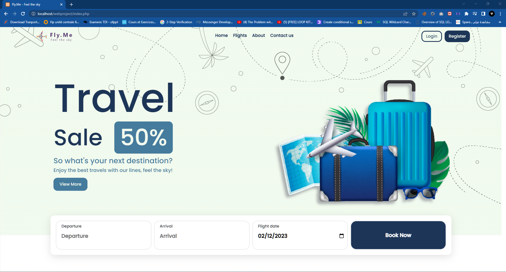

# Fly.Me
> This project is a flight agency website made by Mohamed Addar, it's a school project.

## Table of Contents
* [General Info](#general-information)
* [Technologies Used](#technologies-used)
* [Screenshots](#screenshots)
* [Setup](#setup)
* [Project Status](#project-status)
* [Acknowledgements](#acknowledgements)
* [Contact](#contact)
<!-- * [License](#license) -->

## General Information
- This project is a flight agency website. you can book flights, send messages to admin ... and for admin he has a whole control panel, and a dashboard. 
- Just a school project.

## Technologies Used
-Less
-FPDF
-phpqrcode

## Screenshots

<!-- If you have screenshots you'd like to share, include them here. -->

## Setup
Okay, so in order to test this project you need to create the database, and import the sql file located in the database directory. and enable gd in php.ini.

## Project Status
Project is: _complete_.

## Acknowledgements
Thanks to this platforms for providing such great content
- Picture in this website are from Freepik and Unsplash.
- Animated Icons: [Lord Icons](https://lordicon.com/)
- Color Palette: [Coolors.co](https://coolors.co)

## Contact
Created by [@simon409](https://addar-mohamed.netlify.app/) - feel free to contact me!

